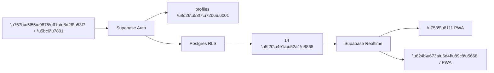

# Supabase 账号验证与跨端同步设计

## 1. 目标与范围

本次将当前本地优先的个人工作台改为受账号保护的云端工作台：

- 使用 Supabase Auth 验证账号和管理会话。
- 使用 Supabase Postgres 存储全部业务数据。
- 同一账号在电脑、手机和已安装 PWA 中看到同一套数据。
- 不同账号的业务数据完全隔离。
- 浏览器打开应用并完成登录后，在适合时提示安装 PWA。

本次不导入现有 IndexedDB 数据，不支持断网写入，不接入微信平台 API，
不增加组织级共享工作区或管理员跨账号查看数据的能力。

## 2. 技术方案

采用 Supabase Auth + Postgres + Row Level Security + Realtime。不自建密码表，
不在业务数据库或前端代码中保存明文密码。



前端仅使用可公开的 Supabase URL 和 anon key。`service_role` 只能保存在
Supabase Edge Function 和本地管理员初始化环境中。Supabase 官方明确要求
`auth.admin.createUser` 仅在服务端调用，不得向浏览器暴露 `service_role`。

参考：

- <https://supabase.com/docs/reference/javascript/auth-admin-createuser>
- <https://supabase.com/docs/guides/database/postgres/row-level-security>
- <https://supabase.com/docs/guides/realtime/postgres-changes>
- <https://supabase.com/docs/guides/auth/password-security>

## 3. 账号模型与初始管理员

### 3.1 `profiles` 表

`profiles` 与 `auth.users` 一对一：

| 字段 | 类型 | 约束与用途 |
| --- | --- | --- |
| `id` | `uuid` | 主键，引用 `auth.users(id)` |
| `username` | `citext` | 唯一、非空，用户可见的登录账号 |
| `role` | `text` | 仅允许 `admin` 或 `member` |
| `is_active` | `boolean` | 是否允许继续使用系统 |
| `must_change_password` | `boolean` | 是否必须完成首次改密 |
| `created_at` | `timestamptz` | 创建时间 |
| `updated_at` | `timestamptz` | 最后修改时间 |

用户在登录页输入短账号，前端将小写并去除首尾空格后映射为内部 Auth 邮箱：

```text
admin -> admin@users.workbench.invalid
```

这个内部邮箱不用于发送邮件，应用界面始终只显示 `profiles.username`。

### 3.2 初始账号

通过仅管理员可运行的 Node.js 脚本创建初始账号：

```text
账号：admin
密码：admin123
角色：admin
状态：active
必须改密：true
```

脚本要求 `SUPABASE_URL` 与 `SUPABASE_SERVICE_ROLE_KEY`，且不得将后者写入
Git、GitHub Pages 构建变量或浏览器产物。脚本必须幂等：已存在 `admin`
时只校验账号资料，不再次重置密码。

## 4. 登录、改密与会话流程

1. 启动时先恢复 Supabase 会话，期间显示“正在验证登录状态”。
2. 无会话时只渲染登录页，不初始化业务 Repository 或 Realtime。
3. 用户输入账号与密码，前端使用内部邮箱调用 `signInWithPassword`。
4. 登录成功后读取当前身份的 `profiles` 记录。
5. 账号停用时立即退出，并显示“账号已停用，请联系管理员”。
6. `must_change_password = true` 时只允许进入强制改密页。业务路由和 RLS
   均拒绝访问，不能通过修改 URL 绕过。
7. 新密码至少 8 位，两次输入一致后，先用当前临时密码重新验证身份，
   再调用 Auth 更新密码，最后通过受控 RPC 将 `must_change_password` 设为 `false`。
   如密码已更新但 profile RPC 临时失败，页面明确提示使用新密码重试完成状态更新，
   不宣称全部成功。
8. 已过期、被撤销或不完整会话自动返回登录页。
9. 顶部显示当前账号、管理员标识和退出按钮。

登录失败统一显示“账号或密码不正确”，不泄露账号是否存在。

## 5. 管理员账号管理

设置中新增仅 `admin` 可见的“账号管理”，支持：

- 新增普通账号或管理员账号，并设置至少 8 位的临时密码。
- 停用或重新启用账号。
- 重置临时密码，并强制对方下次登录改密。
- 查看账号角色、状态和创建时间。

禁止：

- 公开注册。
- 客户端直接调用 Auth Admin API。
- 停用当前登录账号。
- 停用系统中最后一个有效管理员。
- 管理员查看其他账号的业务数据。

账号新增、启停和重置密码通过 `admin-users` Edge Function 完成。
Function 先验证调用者 JWT，再校验调用者是未停用、已完成改密的管理员，
最后才使用服务端 `service_role` 执行 Auth Admin 操作。

## 6. 业务表、RLS 与数据隔离

下列 14 组 Repository 对应的数据表全部迁移到 Postgres：

1. `todos`
2. `semesters`
3. `courses`
4. `teachers`
5. `teacher_year_summaries`
6. `teacher_records`
7. `mentorships`
8. `research_items`
9. `learning_methods`
10. `ideas`
11. `lesson_plans`
12. `students`
13. `student_records`
14. `app_settings`

每张表增加：

```sql
user_id uuid not null references auth.users(id) on delete cascade
```

业务表保留当前 TypeScript entity 的 UUID、创建时间和更新时间语义。
Postgres 使用 `snake_case`，Supabase Repository 负责与前端 `camelCase` 互相转换。

所有业务表启用 RLS。查询、新增、修改和删除同时要求：

- `auth.uid()` 非空。
- `profiles.id = auth.uid()`。
- `profiles.is_active = true`。
- `profiles.must_change_password = false`。
- 数据行 `user_id = auth.uid()`。

`user_id` 的默认值由数据库从 `auth.uid()` 生成，但 RLS 仍必须校验，不信任客户端传值。
外键和唯一约束均加入 `user_id`，避免一个账号的记录引用另一账号的对象。

## 7. Repository 切换与数据映射

新增 `createSupabaseRepositories(client, userId)`，实现现有 `Repositories` 的普通单表 CRUD。
登录且完成强制改密后，`AppProviders` 才创建云端 Repository。

不在云端实现一个虚假的 `transaction(callback)`。浏览器中的多个 HTTP 请求无法
组成真实的 Postgres 事务。依赖原子性的业务操作必须改为对应 SQL RPC：

- `save_todo_with_conflict_check`：检查冲突并保存待办，支持用户确认后覆盖。
- `import_wechat_todos`：校验并批量导入微信解析结果。
- `set_active_semester` 与 `delete_semester`：维护单一当前学期和课程级联。
- `fill_missing_teacher_summaries`：幂等补全当年未填报教师。
- `add_teacher_record` 与 `batch_teacher_records`：校验在岗教师、写入记录并更新年度状态。
- `add_student_record`：校验学生状态并写入日常记录。
- `convert_idea`：幂等转换灵感为科研或备课记录。
- `restore_backup_v1`：校验后原子替换当前账号的全部业务数据。

RPC 必须从 JWT 获取当前用户，禁止以函数参数传入任意 `user_id`。
函数内部的所有查询也必须限定当前用户。任一验证失败时整个 RPC 回滚。

## 8. Realtime 跨端同步

用户进入工作台后，为当前用户的 `profiles` 行和 14 张业务表建立 Postgres Changes 订阅。
Realtime 表加入 `supabase_realtime` publication，RLS 继续决定客户端能收到的数据。
当 profile 变为停用或待改密时，当前客户端立即停止业务查询并退出或进入强制改密。
即使 Realtime 延迟或客户端未及时执行，RLS 也会立即拒绝该会话的后续业务请求。

每个表的 `INSERT` / `UPDATE` / `DELETE` 事件到达时，前端只失效对应的 TanStack Query key，
并从 Supabase 重新获取权威数据。不直接将 Realtime payload 拼接到列表，以避免
重复、乱序、删除遗留和多表事务中间状态。

订阅断开时显示“实时同步已断开，正在重连”。重连成功后全量失效当前用户的查询，
避免遗漏断线期间的数据变更。

## 9. 断网行为

Supabase 是唯一业务数据源。现有 IndexedDB 数据不上传、不合并、不在登录后展示。
IndexedDB Repository 可保留用于既有单元测试和明确的开发测试注入，但生产默认不再使用。

断网时：

- PWA 外壳仍可启动。
- 显示“当前离线，连接网络后可继续”。
- 禁用新增、编辑、删除、批量操作和备份恢复。
- 不创建本地写入队列，不进行冲突合并。
- 恢复网络后重新建立会话、Realtime 和数据查询。

任何 Supabase 写入失败都不显示伪成功。表单保留用户输入，显示可操作的中文错误，
并允许恢复网络后重试。

## 10. 安装横幅

现有常驻 `beforeinstallprompt` 事件捕获机制保留。登录页不显示安装横幅。
用户通过账号验证后：

- 浏览器提供 `beforeinstallprompt` 且应用未以 `standalone` 运行时，显示顶部安装横幅。
- “安装应用”调用浏览器原生安装窗口。
- “暂不安装”保存当前时间，7 天内不再显示。
- 原生安装成功或当前已为 standalone 时不显示。
- iOS / Safari 无原生事件时，在设置与登录后提示中保留“共享 → 添加到主屏幕”说明。

安装提示的拒绝时间是该浏览器应用级设置，不随账号同步。

## 11. 界面和路由

### 11.1 登录页

- 系统名称和简短说明。
- 账号、密码、显示/隐藏密码、登录按钮。
- 提交期间禁用重复提交。
- 账号或密码错误、账号停用、网络失败分别显示稳定中文文案。
- 没有 Supabase 环境变量时显示“系统尚未配置”，不渲染空白页。

### 11.2 强制改密页

- 当前临时密码、新密码、确认新密码。
- 新密码至少 8 位，不得与当前临时密码相同。
- 修改成功后重新获取 profile 并进入工作台。
- 仅提供退出，不显示业务导航。

### 11.3 已登录工作台

- 顶部显示当前账号和角色。
- 设置中提供退出，管理员额外看到账号管理。
- 移动端的“我的”抽屉必须可达退出和账号管理。
- 离线和 Realtime 断开状态用常驻顶部状态条呈现。

## 12. 环境变量与部署

前端构建需要：

```text
VITE_SUPABASE_URL
VITE_SUPABASE_ANON_KEY
```

两者用于浏览器客户端，在 GitHub 仓库中以 Actions Variables 配置。
不在仓库中提交实际值。部署工作流将变量传给 Vite build。

Supabase 项目需要：

- SQL migration：表、约束、索引、RLS、RPC、Realtime publication。
- Edge Function：`admin-users`。
- Edge Function 服务端环境中的 `SUPABASE_SERVICE_ROLE_KEY`。
- 一次性执行的初始管理员脚本。

`.env.example` 仅列出变量名和说明。`.env.local` 、CLI 凭据、service role key
和其他本地秘密必须受 `.gitignore` 保护。

## 13. 错误处理

前端将 Supabase / Postgres 错误码映射为稳定的中文文案，不向终端用户显示 SQL、
表名、内部邮箱、JWT 或原始服务器堆栈。

最低错误类型包括：

- 配置缺失。
- 账号或密码错误。
- 账号停用。
- 必须修改密码。
- 权限不足。
- 唯一性冲突。
- 关联记录不存在或不属于当前用户。
- 时间或日程冲突。
- 当前离线。
- 实时订阅断开。
- 未知服务失败。

未知错误在开发环境记录诊断信息，生产界面仅显示“操作失败，请稍后重试”。

## 14. 测试策略

### 14.1 前端单元与组件测试

- 用户名规范化和内部邮箱映射。
- 会话恢复的 loading、anonymous、must-change、authenticated 状态。
- 未登录和强制改密时不初始化业务页。
- 停用账号退出和中文错误。
- 管理员功能显示与普通账号隐藏。
- Supabase 行与 TypeScript entity 的完整往返映射。
- Realtime 事件只失效对应查询，重连后全量刷新。
- 离线写入禁用和输入保留。
- 安装横幅显示、安装、关闭、7 天冷却和 standalone 隐藏。
- 不存在 Supabase 配置时的安全降级页。

### 14.2 Supabase 本地集成测试

使用 Supabase CLI 本地项目执行 SQL / Auth 集成测试：

- 账号 A 不能查询、修改、删除或引用账号 B 的数据。
- 停用账号和待改密账号无法读写业务表。
- 普通账号无法调用管理员 Edge Function 的敏感动作。
- 最后一个有效管理员不能被停用。
- 各 RPC 成功时完整写入，任一步失败时零部分写入。
- 备份恢复只替换当前账号数据。
- Realtime 仅向订阅者发送其 RLS 可见变更。

### 14.3 生产预览与 E2E

- 首次 `admin / admin123` 登录后必须改密。
- 修改 URL 无法绕过登录或强制改密。
- 管理员新增、停用、启用和重置账号。
- 同一账号的两个浏览器会话实时同步待办。
- 两个不同账号数据互不可见。
- 断网后业务写入被禁止，恢复联网后自动刷新。
- 桌面 Chrome/Edge 安装横幅与移动端安装说明可用。
- 构建产物不包含 `service_role`。
- 现有待办、日历、课程、教师、学生、科研、灵感、备课、导出与备份流程回归通过。

## 15. 上线顺序与完成标准

1. 创建或关联 Supabase 项目。
2. 应用 SQL migrations，启用 RLS、RPC 和 Realtime publication。
3. 部署 `admin-users` Edge Function 并配置服务端秘密。
4. 运行幂等初始化脚本，创建 `admin / admin123`。
5. 在 GitHub Actions Variables 配置前端 URL 和 anon key。
6. 通过 PR 合并前端与部署工作流变更。
7. 等待 GitHub Pages 构建和部署成功。
8. 首次登录并修改默认密码。
9. 在电脑创建待办，验证手机同一账号自动出现。
10. 创建第二账号，验证双向数据隔离和停用会话失效。
11. 验证安装横幅、PWA 安装和重新打开。
12. 完成单元、类型、构建、Supabase 集成、E2E 和密钥扫描门禁。

仅当以上步骤全部通过，且线上工作台的登录、强制改密、实时同步、数据隔离、
账号停用和 PWA 安装均实际可用时，本功能才视为完成。
